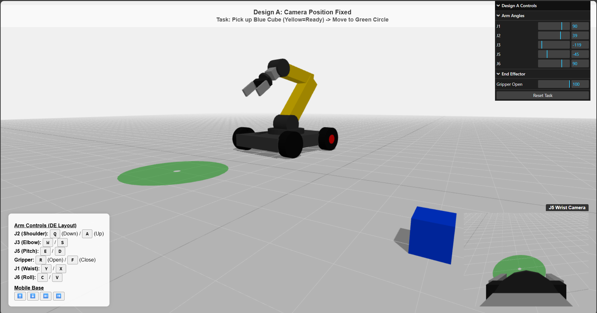
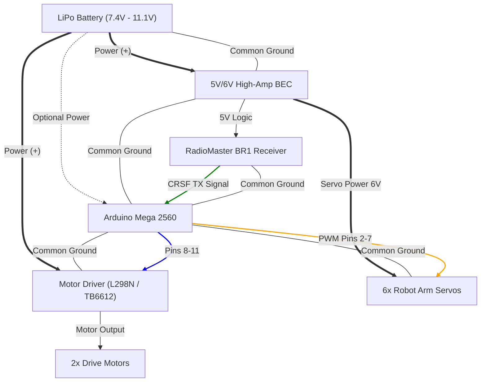

** THIS SETUP IS NOT TESTED ON REAL HARDWARE **
** USE ON YOUR OWN RISK **

---

# Design A: Mobile Robot Arm Control (Arduino Mega + ExpressLRS)

This project implements the control system for [**RC Rover with Robot Arm 6 DOF** by Emre Kalem](https://makerworld.com/en/models/1342319-rc-rover-with-robot-arm-6-dof?from=search#profileId-1383072), a 6-DoF robotic arm mounted on a mobile base. It uses an **Arduino Mega 2560** to receive commands from a **RadioMaster Bandit BR1** (or any ELRS receiver) via the **CRSF protocol** and map them to the robot's actuators.



## 📋 Hardware Requirements

* **Microcontroller:** Arduino Mega 2560
* **Radio Receiver:** RadioMaster Bandit BR1 (or compatible ExpressLRS receiver)
* **Radio Transmitter:** Any EdgeTX/OpenTX radio (e.g., RadioMaster Zorro, TX16S)
* **Motor Driver:** L298N, TB6612FNG, or similar dual H-Bridge driver for the base wheels.
* **Servos:** 6x RC Servos (High torque recommended for Shoulder/Elbow).
* **Power Supply:**
* **5V/6V High-Amp BEC:** To power the servos (Do NOT power servos from the Arduino).
* **Battery:** LiPo battery appropriate for your motors (e.g., 2S or 3S).

## 🔌 Wiring Guide

### ⚡ Critical Power Warning

The most common cause of failure in projects like this is **powering servos from the Arduino**.

* **DO NOT** connect the Red (+) wire of the servos to the Arduino's 5V pin. The Arduino cannot handle the current and will reset or burn out.
* **DO** use a separate power source (BEC or Buck Converter) for the servos.
* **DO** connect all Ground (-) wires together (Arduino + Battery + Servos + Driver).

---

### 1. Wiring Schematic (Mermaid Diagram)

This diagram visualizes the data and power flow.


---

### 2. Detailed Pinout Connections

#### A. RadioMaster BR1 Receiver (CRSF)

* **GND**  Arduino **GND**
* **VCC**  Arduino **5V** (or BEC 5V)
* **TX Pin**  Arduino **Pin 19 (RX1)**
* **RX Pin**  Arduino **Pin 18 (TX1)** *(Optional, only needed if you want telemetry sent back to the radio)*

#### B. Arm Servos (6x)

Connect the **Signal (Yellow/Orange)** wire of each servo to the Arduino. Connect the **Power (Red)** and **Ground (Brown/Black)** to your external power rail (Breadboard/terminal strip).

| Servo Joint | Arduino Pin |
| --- | --- |
| **Waist (J1)** | Pin **2** |
| **Shoulder (J2)** | Pin **3** |
| **Elbow (J3)** | Pin **4** |
| **Wrist Pitch (J5)** | Pin **5** |
| **Wrist Roll (J6)** | Pin **6** |
| **Gripper** | Pin **7** |

#### C. Motor Driver (Example: L298N)

The previous code used a `PWM` + `DIR` logic. Standard L298N drivers use `IN1`, `IN2` and `ENA`. To match the code provided earlier, use this mapping:

* **12V**  Battery (+)
* **GND**  Battery (-) **AND** Arduino GND
* **5V**  *(Leave disconnected if 12V regulator jumper is on, or power logic from Arduino 5V)*

| Arduino Pin | L298N Input | Function |
| --- | --- | --- |
| **Pin 8** | **ENA** | Left Motor Speed (PWM) |
| **Pin 9** | **IN1** | Left Motor Direction* |
| **Pin 10** | **ENB** | Right Motor Speed (PWM) |
| **Pin 11** | **IN3** | Right Motor Direction* |

> **Note on L298N Logic:** The code provided assumes a simple DIR/PWM driver. For a standard L298N:
> 1. Connect Arduino **Pin 9** to **IN1**.
> 2. Connect **IN2** directly to **GND** (Ground).
> 3. This setup allows forward/stop/speed control. To get **Reverse** with the existing code, you would need to change the Arduino script to control 3 pins (IN1, IN2, ENA) per motor, or use a "NOT gate" inverter between IN1 and IN2.

### 3. Physical Wiring Layout (Breadboard View)

Since I cannot generate an image file, visualize the layout as follows:

1. **Central Hub (Breadboard):** Use the power rails of a breadboard to distribute the **BEC 6V** and **GND**.
2. **Servo Rail:** Plug all 6 Servo Red wires into the Breadboard (+) Rail and all 6 Brown wires into the Breadboard (-) Rail.
3. **Signal Wires:** Run the 6 Yellow wires directly from the Servos to the Arduino Digital Pins 2-7.
4. **RX Connection:** The Receiver is small. You can power it from the Arduino's 5V pin (since it draws very little current), but ensure the **TX wire goes to Pin 19**.
5. **Motor Driver:** This is usually a separate module. Run heavy gauge wires from the battery to the driver, and thinner jumper wires from the Driver's logic pins to Arduino 8-11.

## 🛠️ Software Installation

1. **Install Arduino IDE:** Download from [arduino.cc](https://www.arduino.cc/en/software).
2. **Install Dependencies:**
* Open Arduino IDE.
* Go to `Sketch` -> `Include Library` -> `Manage Libraries...`
* Search for **"AlfredoCRSF"** and **"ServoEasing"** and install it.
* (The standard `Servo` library is pre-installed).

3. **Flash the Code:**
* Open the `DesignA_Control.ino` file.
* Select your board: `Tools` -> `Board` -> `Arduino Mega or Mega 2560`.
* Select your port: `Tools` -> `Port` -> `(Your COM Port)`.
* Click **Upload**.

## 🎮 Controls (Default Mapping)

These mappings depend on your specific radio transmitter setup (Mixer), but the code expects channels 1-8.

| Channel | Input Type | Function |
| --- | --- | --- |
| **CH 1** | Right Stick X | **Waist** Rotation |
| **CH 2** | Right Stick Y | **Shoulder** Up/Down |
| **CH 3** | Left Stick Y | **Mobile Base** Forward/Reverse |
| **CH 4** | Left Stick X | **Mobile Base** Turn Left/Right |
| **CH 5** | Pot / Slider | **Elbow** |
| **CH 6** | Pot / Slider | **Wrist Pitch** |
| **CH 7** | Slider | **Wrist Roll** |
| **CH 8** | Switch | **Gripper** Open/Close |

## ⚡ Safety & Troubleshooting

* **Power Separation:** The most common issue is the Arduino resetting when a servo moves. This happens if you power servos from the Arduino's 5V pin. **Always use an external power supply for servos.**
* **Failsafe:** The code includes a basic failsafe. If the radio disconnects, the mobile base motors will stop.
* **Servo Limits:** In the code (`controlArm` function), adjust the `map()` output values (e.g., `0, 180`) to match the physical limits of your 3D printed parts. Forcing a servo past its mechanical limit will strip the gears or burn the motor.

## 📝 Configuration (In Code)

To change pins or adjust speed/angles, look at the top of the script:

```cpp
// --- Pin Definitions ---
const int PIN_WAIST     = 2;
// ... change as needed

// --- Control Logic ---
// Inside controlArm():
sWaist.write(map(chWaist, 1000, 2000, 0, 180)); 
// Change 0, 180 to limit travel (e.g., 45, 135)


```
